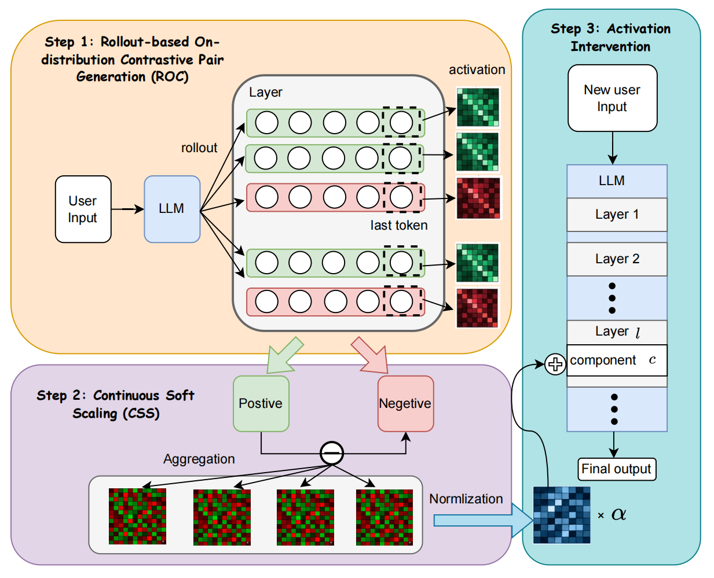

<div align="center">

# ORBIT

**On-policy activation steering: build steering vectors from the model's own reasoning, not from hand-written text.**

[](https://www.python.org/)
[](https://pytorch.org/)
[](https://github.com/huggingface/transformers)
[](#license)

</div>

---

## Results

ORBIT improves on the unsteered model in all 16 cells, across 8 models from 0.6B to 122B (dense and MoE, three families). Accuracy (%) ± std over three seeds.

| Model | IFEval | + ORBIT | Δ | TruthfulQA | + ORBIT | Δ |
|---|:---:|:---:|:---:|:---:|:---:|:---:|
| Qwen3-0.6B | 62.46 ± 1.27 | **63.27 ± 0.28** | +0.81 | 48.78 ± 0.52 | **49.91 ± 0.23** | +1.13 |
| Qwen3-8B | 77.35 ± 0.32 | **80.50 ± 1.98** | +3.15 | 78.66 ± 0.16 | **81.62 ± 0.03** | +2.96 |
| GLM4-9B | 81.02 ± 0.12 | **81.82 ± 0.42** | +0.80 | 53.83 ± 0.01 | **60.10 ± 0.17** | +6.27 |
| Qwen3-14B | 79.89 ± 0.57 | **81.30 ± 0.28** | +1.41 | 80.31 ± 1.22 | **82.32 ± 0.44** | +2.01 |
| Qwen3-32B | 80.31 ± 0.14 | **81.02 ± 0.71** | +0.71 | 85.39 ± 0.21 | **86.64 ± 0.21** | +1.25 |
| GLM4-32B | 80.31 ± 0.71 | **81.11 ± 0.71** | +0.80 | 57.40 ± 1.66 | **69.51 ± 3.83** | +12.11 |
| Llama-3-70B | 81.02 ± 0.44 | **82.19 ± 0.53** | +1.17 | 85.20 ± 0.61 | **86.83 ± 0.70** | +1.63 |
| Qwen3.5-122B-A10B | 84.31 ± 0.29 | **85.12 ± 0.45** | +0.81 | 90.40 ± 0.22 | **91.35 ± 0.28** | +0.95 |

<sub>Standard configuration: grouped normalization, L2 scaling, N = 1000 training questions (IFEval N = 100). The largest gains are on reasoning tasks, e.g. +9.7 on GSM8K at 0.6B.</sub>

## Overview

Contrastive activation steering methods such as CAA, ITI and RepE usually build their steering direction from **text the experimenter writes**, for example a gold answer versus a wrong one. The activations are recorded while the model *reads* that text, not while it *reasons*.

ORBIT reads the contrast from the model's own generations:

1. **Rollout.** Sample several responses for each training question.
2. **Verify.** An outcome verifier sorts each response into a success or a failure.
3. **Contrast.** Take the difference between the activations of the successful and the failed trajectories.
4. **Steer.** At inference, add the aggregated and normalized difference vector to selected layers. No retraining is needed and no extra context is added to the prompt.

<p align="center">
  
</p>

## Highlights

| | |
|---|---|
| **On-distribution pairs (ROC)** | Positive and negative samples both come from the model's own rollouts, so the steering vector is extracted under the same distribution it is applied to. |
| **Continuous Soft Scaling (CSS)** | Keeps the full difference vector and rescales it continuously (`max_norm`, `l2_norm` or `softmax`) instead of applying a binary Top-K mask. |
| **One question, one vote** | `--grouped_normalization` normalizes per question before averaging, so questions that produce many pairs do not dominate the vector. |
| **Re-read fallback** | Questions whose rollouts contain no correct answer fall back to a re-read of the reference answer, which can be down-weighted with `--reread_weight`. |
| **Works across model families** | Supports Llama 3, Qwen 3, GLM and Gemma 3, with intervention on MLP activations and/or attention outputs. |
| **Multi-GPU** | Rollout generation and evaluation run in parallel through `torchrun`. |

## Method

For a question $q$, sample $n$ rollouts $\{r_1,\dots,r_n\}$ and split them by the verifier into $\mathcal{R}^+$ and $\mathcal{R}^-$. Let $h_\ell(q, r)$ be the activation at layer $\ell$ of a chosen component (by default at the last token). The per-question difference is

$$
\Delta_\ell(q) = \frac{1}{|\mathcal{R}^+|}\sum_{r\in\mathcal{R}^+} h_\ell(q,r) \;-\; \frac{1}{|\mathcal{R}^-|}\sum_{r\in\mathcal{R}^-} h_\ell(q,r),
$$

and the differences are averaged over questions to get $\mu_\ell$. CSS then converts $\mu_\ell$ into a continuous weight vector $\beta_\ell$, and inference applies

$$
h'_\ell = h_\ell + \alpha \cdot \beta_\ell \odot \mu_\ell .
$$

| `--scaling` | Weight $\beta_i$ | Behavior |
|---|---|---|
| `max_norm` (default) | $\mu_i / \max_j \lvert\mu_j\rvert$ | Keeps relative magnitudes, bounded in $[-1, 1]$ |
| `l2_norm` | $\mu_i / \lVert\mu\rVert_2$ | Unit-norm direction |
| `softmax` | $\mathrm{softmax}(\lvert\mu\rvert)_i \cdot \mathrm{sign}(\mu_i) \cdot d$ | Emphasizes the largest dimensions |
| `none` | $1$ | Raw difference vector |

## Installation

```bash
git clone https://github.com/TomySu404/ORBIT.git
cd ORBIT
pip install -r requirements.txt
```

## Data

Datasets are read from `--data_root` (default `./data`) with the following layout:

```text
data/
├── gsm8k/        train.jsonl, test.jsonl
├── math500/      test.jsonl
├── ifeval/       test.jsonl
├── mmlu/         test/
├── truthfulqa/   mc_task.json
├── boolq/        train.jsonl, dev.jsonl
├── winogrande/   train_m.jsonl, dev.jsonl
├── xcopa/        test.en.jsonl
├── mnli/         xnli.dev.tsv, xnli.test.tsv
└── SST/          sst2/{train,test}.jsonl, sst5/{train,test}.jsonl
```

Supported names for `--datasets` are `gsm8k`, `math500`, `ifeval`, `mmlu`, `truthfulqa`, `boolq`, `copa`, `winogrande`, `xnli`, `sst2`, `sst5` and `spider`.

## Quick Start

**Single GPU**

```bash
python main.py \
    --model Qwen/Qwen3-8B \
    --datasets gsm8k \
    --format_type chat \
    --max_new_tokens 512 --max_rollout_tokens 512 \
    --num_rollouts 8 \
    --grouped_normalization
```

**Multi-GPU**

```bash
torchrun --nproc_per_node=8 main.py --parallel_gpus \
    --model meta-llama/Llama-3.1-8B-Instruct \
    --datasets gsm8k math500 ifeval \
    --format_type chat \
    --grouped_normalization
```

**Tune strength and layers on a dev split first**

```bash
python main.py --model Qwen/Qwen3-8B --datasets gsm8k --tune_hyperparams --dev_ratio 0.2
```

Results, including baseline and steered metrics and the extracted steering vectors, are written to `--output_dir` (default `./results`).

## Key Arguments

| Argument | Default | Description |
|---|---|---|
| `--model` | `meta-llama/Llama-3.1-8B-Instruct` | HuggingFace model name or local path |
| `--datasets` | `sst2` | One or more datasets to run |
| `--num_rollouts` | `8` | Rollouts sampled per training question |
| `--temperature` / `--top_p` | `0.8` / `0.9` | Rollout sampling parameters |
| `--strength` | `0.2` | Intervention strength $\alpha$ |
| `--scaling` | `max_norm` | CSS method: `max_norm`, `l2_norm`, `softmax`, `none` |
| `--layer_scope` | `first_n` | Which layers to steer: `all`, `first_n`, `last_n` |
| `--num_layers` | `5` | Number of layers when using `first_n` / `last_n` |
| `--components` | `mlp_act,attn_out` | Comma-separated components to intervene on |
| `--intervention_type` | `add` | `add`: $h + \alpha\Delta$; `mul`: $h + h \odot \alpha\Delta$ |
| `--grouped_normalization` | off | Per-question normalization before global averaging |
| `--prefill_only` | off | Steer only during the prefill phase |
| `--no_reread` / `--reread_weight` | off / `1.0` | Disable or down-weight the re-read fallback |
| `--format_type` | `generation` | `generation` (plain concatenation) or `chat` (chat template) |
| `--enable_thinking` | off | Enable thinking mode in the chat template |
| `--seeds` | `42 22 52` | Evaluation seeds |
| `--tune_hyperparams` | off | Grid-search hyperparameters on a dev split |

Run `python main.py --help` for the full list.

## Project Structure

```text
ORBIT/
├── main.py                  # Entry point: extraction, steering and evaluation
├── config.py                # Experiment, rollout and intervention configs
├── models/
│   └── wrapper.py           # Model wrapper and activation hooks
├── steering/
│   ├── rollout.py           # Rollout generation and contrastive pairing (ROC)
│   ├── diff_vector.py       # Difference vectors, aggregation and CSS
│   ├── intervention.py      # Hook-based activation intervention
│   └── context_ablation.py  # Extraction-context ablations
├── data/
│   └── loader.py            # Dataset loaders and prompt formatting
└── utils/
    ├── metrics.py           # Evaluation metrics
    └── ifeval_instructions.py
```

## License

This project is released under the MIT License.
